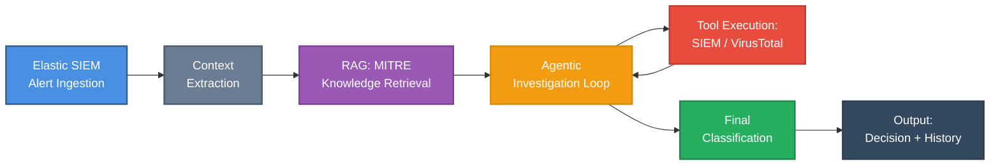

# SOC AI Triage Agent

This project is an automated Security Operations Center (SOC) Triage Agent designed to assist security analysts by performing initial analysis and classification of security alerts from Elastic SIEM using a local Large Language Model (deepseek-r1:8b via Ollama). The agent features an **agentic investigation workflow** with tool calling, RAG-enhanced MITRE ATT&CK knowledge, and external threat intelligence enrichment.

## Workflow

The agent follows an iterative, agentic pipeline to process alerts:

### High-Level Overview



### Detailed Workflow Diagram

```mermaid
flowchart TD
    Start([Start: Fetch Alerts]) --> Fetch[Fetch Recent Alerts<br/>from Elastic SIEM]
    Fetch --> CheckAlerts{Alerts<br/>Found?}
    CheckAlerts -->|No| End([End: No Alerts])
    CheckAlerts -->|Yes| Extract[Extract Alert Context<br/>Normalize Data]
    
    Extract --> RAG[Query RAG Vector DB<br/>Retrieve MITRE ATT&CK Techniques]
    RAG --> InitLoop[Initialize Investigation Loop<br/>Turn = 1, Max = 5]
    
    InitLoop --> Decision{LLM Decision:<br/>Need More Info?}
    
    Decision -->|Yes: Use Tool| CheckMandatory{Mandatory SIEM<br/>Query Used?}
    CheckMandatory -->|No| ForceSIEM[Force SIEM Query]
    CheckMandatory -->|Yes| SelectTool{Select Tool}
    
    ForceSIEM --> SelectTool
    SelectTool -->|query_siem_host_logs| SIEMQuery[Query SIEM Host Logs<br/>Time Window Search]
    SelectTool -->|query_virustotal| VTQuery[Query VirusTotal<br/>IOC Reputation Check]
    
    SIEMQuery --> CheckDuplicate{Duplicate<br/>Query?}
    VTQuery --> CheckDuplicate
    CheckDuplicate -->|Yes| BlockDuplicate[Block Duplicate<br/>Add to History]
    CheckDuplicate -->|No| Execute[Execute Tool]
    BlockDuplicate --> IncrementTurn
    
    Execute --> Summarize[Summarize Tool Result<br/>Add to Investigation Journal]
    Summarize --> IncrementTurn[Increment Turn]
    IncrementTurn --> CheckTurns{Turn <= 5?}
    CheckTurns -->|Yes| Decision
    CheckTurns -->|No| FinalClassify
    
    Decision -->|No: Ready to Classify| CheckMandatoryFinal{Mandatory SIEM<br/>Query Used?}
    CheckMandatoryFinal -->|No| ForceSIEM
    CheckMandatoryFinal -->|Yes| FinalClassify[Final Classification<br/>with Full Investigation History]
    
    FinalClassify --> LLMAnalysis[LLM Analysis<br/>AlertContext + MITRE + History]
    LLMAnalysis --> Output[Generate Classification:<br/>- Classification<br/>- Confidence<br/>- Reasoning<br/>- Action<br/>- MITRE Techniques<br/>- Investigation History]
    
    Output --> NextAlert{More<br/>Alerts?}
    NextAlert -->|Yes| Extract
    NextAlert -->|No| End
    
    style Start fill:#4A90E2,stroke:#2E5C8A,stroke-width:2px,color:#fff
    style End fill:#34495E,stroke:#2C3E50,stroke-width:2px,color:#fff
    style Fetch fill:#6B7C93,stroke:#4A5A6B,stroke-width:2px,color:#fff
    style Extract fill:#6B7C93,stroke:#4A5A6B,stroke-width:2px,color:#fff
    style RAG fill:#9B59B6,stroke:#7D3C98,stroke-width:2px,color:#fff
    style InitLoop fill:#6B7C93,stroke:#4A5A6B,stroke-width:2px,color:#fff
    style Decision fill:#F39C12,stroke:#D68910,stroke-width:2px,color:#fff
    style CheckMandatory fill:#F39C12,stroke:#D68910,stroke-width:2px,color:#fff
    style CheckMandatoryFinal fill:#F39C12,stroke:#D68910,stroke-width:2px,color:#fff
    style SelectTool fill:#F39C12,stroke:#D68910,stroke-width:2px,color:#fff
    style CheckDuplicate fill:#F39C12,stroke:#D68910,stroke-width:2px,color:#fff
    style CheckTurns fill:#F39C12,stroke:#D68910,stroke-width:2px,color:#fff
    style CheckAlerts fill:#F39C12,stroke:#D68910,stroke-width:2px,color:#fff
    style NextAlert fill:#F39C12,stroke:#D68910,stroke-width:2px,color:#fff
    style SIEMQuery fill:#E74C3C,stroke:#C0392B,stroke-width:2px,color:#fff
    style VTQuery fill:#E74C3C,stroke:#C0392B,stroke-width:2px,color:#fff
    style Execute fill:#E74C3C,stroke:#C0392B,stroke-width:2px,color:#fff
    style ForceSIEM fill:#E67E22,stroke:#D35400,stroke-width:2px,color:#fff
    style BlockDuplicate fill:#95A5A6,stroke:#7F8C8D,stroke-width:2px,color:#fff
    style Summarize fill:#6B7C93,stroke:#4A5A6B,stroke-width:2px,color:#fff
    style IncrementTurn fill:#6B7C93,stroke:#4A5A6B,stroke-width:2px,color:#fff
    style FinalClassify fill:#27AE60,stroke:#1E8449,stroke-width:2px,color:#fff
    style LLMAnalysis fill:#27AE60,stroke:#1E8449,stroke-width:2px,color:#fff
    style Output fill:#27AE60,stroke:#1E8449,stroke-width:2px,color:#fff
```



### Detailed Workflow Steps

1.  **Ingestion (`elastic/`)**: 
    *   Connects to the Elastic SIEM instance using the provided API key.
    *   Fetches recent "open" security alerts within a specified timeframe.

2.  **Context Extraction (`elastic/context.py`)**:
    *   Parses the raw JSON alert data from Elastic.
    *   Extracts critical fields such as:
        *   **Rule Info:** Name, ID, Description, Mitre Tactics.
        *   **Entities:** Hostname, IP, User, Process path, Parent process.
        *   **Event Data:** Command lines, PowerShell script blocks (decoding if necessary), file modifications.
    *   Normalizes this data into a streamlined `AlertContext` dictionary, removing noise to focus the LLM on relevant signals.

3.  **RAG-Enhanced Knowledge Retrieval (`rag/`)**:
    *   Queries a ChromaDB vector database containing MITRE ATT&CK techniques.
    *   Uses semantic search to retrieve relevant attack patterns based on alert context.
    *   Enhances the LLM's understanding with authoritative threat intelligence.

4.  **Agentic Investigation Loop (`triage/classifier.py`)**:
    *   The agent performs up to 5 investigation turns, actively gathering evidence before classification.
    *   **Available Tools:**
        *   `query_siem_host_logs`: Query Elastic SIEM for host activity logs around the alert timeframe (MANDATORY - must be used at least once).
        *   `query_virustotal`: Check IOC reputation (IPs, domains, file hashes) against VirusTotal API.
    *   **Guardrails:**
        *   Prevents duplicate queries within the same investigation.
        *   Enforces mandatory SIEM query before final classification.
        *   Limits investigation to 5 turns to prevent infinite loops.
    *   Maintains an investigation journal tracking all tool calls and results.

5.  **AI Analysis (`llm/`)**:
    *   Constructs targeted prompts for the LLM (`deepseek-r1:8b` via Ollama).
    *   Prompts include normalized `AlertContext`, relevant MITRE techniques (from RAG), and investigation history.
    *   The LLM acts as a "SOC Tier 2 Analyst" to evaluate the alert with full context.

6.  **Decision & Classification**:
    *   The LLM returns a structured assessment containing:
        *   **Classification:** `benign`, `suspicious`, or `malicious`.
        *   **Confidence:** A score (0-100) indicating certainty.
        *   **Reasoning:** A concise technical explanation referencing investigation findings.
        *   **Recommended Action:** `ignore`, `investigate`, `contain`, or `escalate`.
        *   **Mitre Techniques:** Mapped techniques observed in the activity.
        *   **Investigation History:** Complete journal of all tool calls and results for transparency.

## Benefits

*   **Combats Alert Fatigue:** Automatically filters out benign false positives so analysts can focus on high-fidelity threats.
*   **Speed & Scalability:** Can analyze alerts in seconds, allowing the SOC to keep up with high alert volumes 24/7.
*   **Consistency:** Applies the same rigorous analysis logic to every alert, reducing human variability and bias.
*   **Contextual Insight:** Provides clear reasoning for *why* an alert was flagged, with full investigation history for transparency.
*   **Active Investigation:** Goes beyond passive analysis by actively querying SIEM logs and threat intelligence to gather evidence.
*   **RAG-Enhanced Intelligence:** Leverages MITRE ATT&CK knowledge base for accurate technique mapping and context.
*   **Privacy First:** Uses a local LLM (deepseek-r1:8b), ensuring sensitive security data never leaves your environment (except optional VirusTotal API calls).

## Prerequisites

*   **Python 3.10+**
*   **Elasticsearch & Kibana** (Running and accessible)
*   **Ollama** (Running locally with `deepseek-r1:8b` model pulled)
    ```bash
    ollama pull deepseek-r1:8b
    ```
*   **VirusTotal API Key** (Optional, for IOC enrichment)
    *   Sign up at [virustotal.com](https://www.virustotal.com) to get a free API key
*   **MITRE ATT&CK Data** (Optional, for RAG functionality)
    *   Place `mitre-attack.json` in the `Rag-Data/` directory
    *   Run `python rag/ingestion.py` to populate the vector database

## Setup & Usage

1.  **Install Dependencies:**
    ```bash
    pip install requests python-dotenv chromadb
    ```

2.  **Configure Environment Variables:**
    Create a `.env` file in the project root or set environment variables:
    ```powershell
    # Required: Elastic SIEM connection
    $env:ELASTIC_BASE_URL="https://<your-elastic-ip>:9200"
    $env:ELASTIC_API_KEY="<your-api-key>"
    
    # Optional: VirusTotal API (for IOC enrichment)
    $env:VT_API_KEY="<your-virustotal-api-key>"
    ```
    
    Or create a `.env` file:
    ```env
    ELASTIC_BASE_URL=https://<your-elastic-ip>:9200
    ELASTIC_API_KEY=<your-api-key>
    VT_API_KEY=<your-virustotal-api-key>
    ```

3.  **Initialize RAG Knowledge Base (Optional but Recommended):**
    ```bash
    # Ensure mitre-attack.json is in Rag-Data/ directory
    python rag/ingestion.py
    ```
    This populates ChromaDB with MITRE ATT&CK techniques for enhanced context.

4.  **Run the Agent:**
    ```bash
    python main.py
    ```
    
    The agent will:
    - Fetch recent alerts from Elastic SIEM
    - For each alert, perform an agentic investigation (up to 5 turns)
    - Use tools to query SIEM logs and optionally VirusTotal
    - Provide a final classification with full investigation history

## Agentic Investigation Features

The agent uses a **ReAct (Reason + Act)** loop pattern to actively investigate alerts:

1. **Tool Decision Phase**: The LLM analyzes the alert context and investigation history to decide if it needs more information or is ready to classify.

2. **Tool Execution**: If more information is needed, the agent selects and executes a tool:
   - **SIEM Query**: Searches for host logs in a time window around the alert (BEFORE, AFTER, or CENTERED)
   - **VirusTotal Lookup**: Checks reputation of IPs, domains, or file hashes

3. **Evidence Accumulation**: Tool results are summarized and added to the investigation journal.

4. **Iteration**: The process repeats (up to 5 turns) until the agent has sufficient evidence or reaches the turn limit.

5. **Final Classification**: With the complete investigation history, the LLM makes a final assessment, explicitly referencing how each investigation step influenced the decision.

**Safety Guardrails:**
- Prevents duplicate queries (same tool with same parameters)
- Enforces mandatory SIEM investigation before classification
- Hard limit of 5 investigation turns to prevent resource exhaustion
- Parametrized tool calls (no raw KQL generation) to prevent syntax errors

## Project Structure

*   `main.py`: Entry point orchestrating the workflow.
*   `elastic/`: 
    *   `client.py`: Elasticsearch API client wrapper.
    *   `alerts.py`: Fetches security alerts from Elastic SIEM.
    *   `context.py`: Extracts and normalizes alert context data.
    *   `investigation.py`: SIEM investigation tools (host log queries).
*   `llm/`: 
    *   `client.py`: Client interface for the local Ollama instance.
    *   `prompts.py`: Prompt templates for triage classification.
    *   `tool_prompts.py`: Prompts for agentic tool decision-making.
*   `triage/`: 
    *   `classifier.py`: Main AlertClassifier with agentic investigation loop.
    *   `schemas.py`: Output validation schemas.
*   `rag/`: 
    *   `vectordb.py`: ChromaDB vector database interface for MITRE ATT&CK.
    *   `ingestion.py`: Script to populate vector DB with MITRE data.
*   `enrichment/`: 
    *   `virustotal.py`: VirusTotal API client for IOC reputation checks.
    *   `ioc_extractor.py`: Utility for extracting IOCs from alert context.
*   `Rag-Data/`: Directory containing MITRE ATT&CK JSON data files.
*   `chroma_db/`: Persistent ChromaDB storage (created automatically).
*   `config.yaml`: Configuration file (currently empty).
*   `PHASE_2_DESIGN.md`: Design document for agentic investigation features.
*   `ROADMAP.md`: Project roadmap and future plans.
